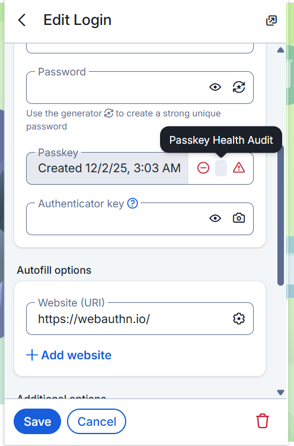

# Passkey Health Manager

A Chrome extension that helps users manage passkeys with health auditing features. Track passkey security, detect weak keys, monitor share counts, and maintain export history.

## Features

- **Passkey Management**: Store and manage passkeys for different websites
- **Health Monitoring**: Real-time health score based on key strength
- **Weak Key Detection**: Automatic detection of compromised or weak keys using hash collision detection
- **Share Tracking**: Monitor how many times each passkey has been shared
- **Export History**: Track vault exports with timestamps and destinations
- **Security Dashboard**: Comprehensive analytics and security recommendations

## Prerequisites

- Node.js (v16 or higher)
- npm (v7 or higher)
- Google Chrome browser

## Installation & Setup

### 1. Clone the Repository

```bash
git clone https://github.com/Risvy/Passkey-Health-Manager.git
cd Passkey-Health-Manager/passkey-health-manager
```

### 2. Install Dependencies

```bash
npm install
```

### 3. Build the Extension

For development:
```bash
npm run dev
```

For production:
```bash
npm run build
```

This will create a `dist/` folder with the compiled extension.

### 4. Load Extension in Chrome

1. Open Google Chrome
2. Navigate to `chrome://extensions/`
3. Enable **Developer mode** (toggle in the top-right corner)
4. Click **Load unpacked**
5. Select the `dist/` folder from this project
6. The extension icon should appear in your Chrome toolbar

## Usage

### Adding a Passkey

1. Click the extension icon in Chrome toolbar
2. Click the **+** button
3. Enter the website (Relying Party ID) and username
4. Click **Create Passkey**

### Viewing Health Dashboard

1. Click the extension icon
2. Click on the **Health Score** card
3. View detailed analytics, security recommendations, and export history

### Sharing a Passkey

1. In the popup, find the passkey you want to share
2. Click the **Share** button
3. Share count will increment and be tracked

### Exporting Vault

1. Click the extension icon
2. Click the **Export** button (download icon)
3. Enter a destination/recipient name
4. Click **Confirm Export**
5. All passkeys will have their share count incremented

## Interface Comparison

This extension extends Bitwarden's functionality with customized health monitoring features.

<table>
<tr>
<td width="50%">

**Official Bitwarden**


</td>
<td width="50%">

**Our Customized Version**



</td>
</tr>
</table>

## Security Features

### Weak Key Detection

The extension uses SHA-256 hash-based collision detection to identify weak or compromised keys:

1. When a passkey is created, its public key is hashed
2. The hash is compared against existing hashes in the database
3. If a collision is found, the key is marked as weak
4. Weak keys are highlighted in red in the UI

### Health Score Calculation

```
Health Score = (Healthy Keys / Total Keys) × 100
```

- **80-100%**: Excellent security posture
- **60-79%**: Good security posture
- **40-59%**: Fair security posture
- **0-39%**: Poor security posture

### Security Recommendations

The dashboard provides actionable recommendations:

- **Critical**: Weak keys detected - recreate immediately
- **Warning**: High share count (3+) - consider key rotation
- **All Clear**: No immediate action required

### Health Audit Dashboard


The health dashboard provides detailed insights into your passkey security:


## Technology Stack

- **React 18** - UI framework
- **TypeScript** - Type-safe development
- **Vite** - Build tool and dev server
- **Tailwind CSS** - Utility-first styling
- **Chrome Extension API** - Browser integration
- **Lucide React** - Icon library

## Testing Features

### Simulate Weak Key

For testing purposes, you can simulate weak key generation:

1. Ensure you have at least one existing passkey
2. Click **Add Passkey**
3. Check **Simulate Weak Key Generation**
4. Create the passkey
5. The new passkey will be marked as weak due to hash collision

## Troubleshooting

### Extension Not Loading

- Ensure you've run `npm run build` first
- Verify you're loading the `dist/` folder, not the root project folder
- Check Chrome DevTools console for errors

### Data Not Persisting

- Ensure the extension has proper permissions in `chrome://extensions/`
- Check that storage permission is granted in manifest.json

### Build Errors

- Delete `node_modules/` and `dist/` folders
- Run `npm install` again
- Run `npm run build`

## License

This project is for research and educational purposes.

## Contributing

This is a research project. For questions or issues, please contact the repository maintainer.
